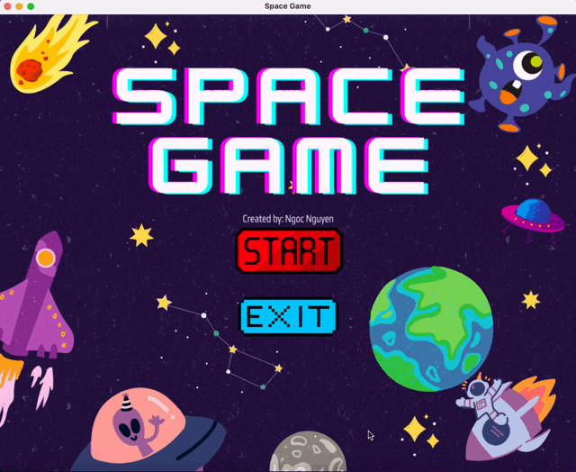
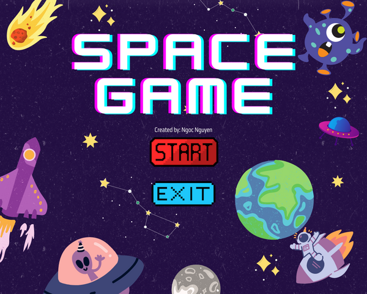
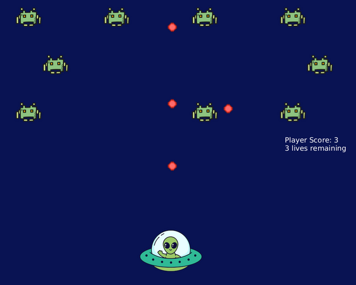

# Space Game

A Galaga-style space shooter written in Scala 3 with ScalaFX. Dodge the alien swarm's fire, shoot them down, and hold **R** to rewind time when things go wrong.

I first built this for my CS2 course at Trinity University, then later refactored it into a standard sbt project with the game logic separated from the UI and covered by unit tests.



| Start screen | In game |
| --- | --- |
|  |  |

## Features

- A swarm of enemies whose rows sway in opposite directions and fire back at random.
- Bullets that collide cancel each other out, so you can shoot down incoming fire.
- **Time rewind:** hold R to play the last 10 seconds backwards, including lost lives and destroyed enemies.
- Score and lives HUD, start screen, and game-over screen with restart.

## Controls

| Key | Action |
| --- | --- |
| Arrow keys or W / A / S / D | Move |
| Space | Shoot |
| R (hold) | Rewind time |

## Running it

You need a JDK (17 or newer) and [sbt](https://www.scala-sbt.org/download/). sbt downloads Scala, ScalaFX and the right JavaFX build for your OS on first run.

```bash
git clone https://github.com/nhngoc02/scala-space-game.git
cd scala-space-game
sbt run    # play the game
sbt test   # run the unit tests
```

## How it's built

**Tech stack:** Scala 3, ScalaFX / JavaFX 21, sbt, MUnit, GitHub Actions.

```
src/main/scala/spacegame/
├── SpaceGameApp.scala   # entry point: window, input handling, game loop
├── Renderer.scala       # draws the current game state onto the canvas
├── Layout.scala         # menu button positions (shared by drawing and click handling)
├── Assets.scala         # loads images from src/main/resources/images
├── model/
│   ├── Entities.scala   # Player, Enemy, Bullet
│   ├── EnemySwarm.scala # enemy grid, swaying and hit detection
│   ├── World.scala      # one immutable frame of the game and its update rules
│   ├── Game.scala       # screens (start / playing / game over) and rewind history
│   └── Settings.scala   # tunable rules: speeds, lives, fire rates
└── util/
    ├── Vec2.scala       # 2D vector math
    └── Rect.scala       # axis-aligned collision boxes
src/test/scala/          # MUnit tests for the model and utilities
```

Design notes:

- **Game logic is pure and UI-free.** `World.step(input, rng)` takes the keys pressed and returns the next frame. Nothing in `model/` touches JavaFX, so the rules are unit-tested without opening a window.
- **Rewind falls out of immutability.** Every frame is an immutable `World`, so the rewind history is just a capped list of previous worlds. No deep copying is needed and memory stays bounded.
- **Rules live in one place.** Speeds, fire rates, lives and swarm size are fields on `Settings`, rather than numbers scattered through the game loop.
